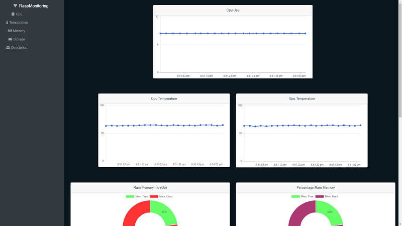
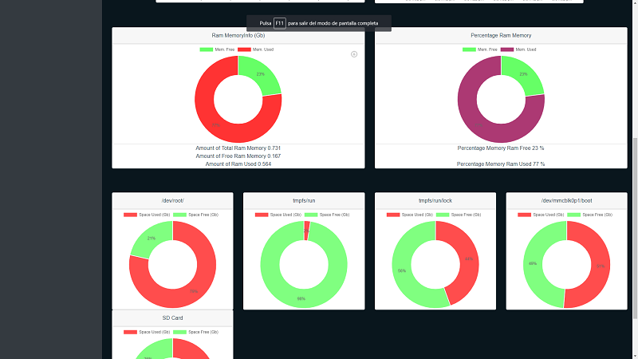
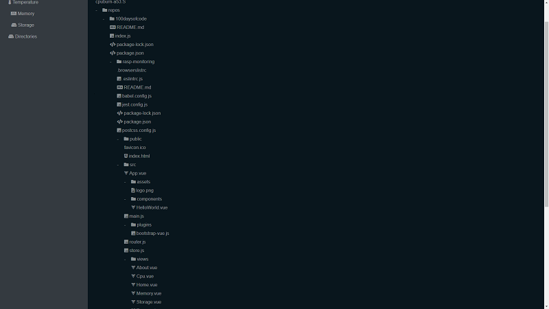
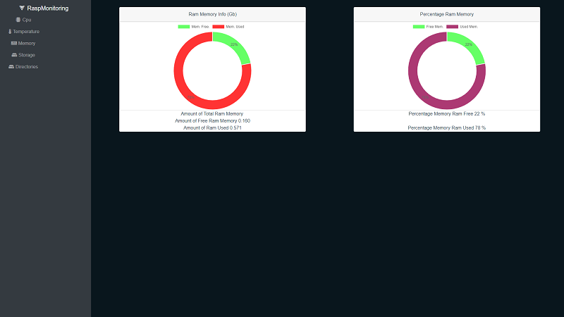

# App para el challenge de 100daysofcode

Aplicación creada para el challenge de 100daysofcode. Esta aplicación, será una app para monitorizar una raspberry pi.
Para ello, se han utilizado nodeJs como servidor de la app y poder acceder a la información de la raspberry, y para la visualización de los datos obtenidos del mismo se usó VueJs.

## Reglas 100daysofcode

Las dos principales reglas son las siguientes:
* Programas una hora al día los próximos 100 días.
* Tweetear el progreso del día con el hastag #100DaysOfCode

### Arrancar el lado servidor

Para arrancar el servidor, primero instalar las dependencias `npm install` y posteriormente, en la carpeta raíz del proyecto arrancarlo mediante el comando `node index.js`

### Arrancar el lado cliente

Si es la primera vez que ejecuta la app, instalar las dependencias mediante el comando `npm install`
Para arrancar el lado cliente, dirigirse a la carpeta rasp-monitoring `cd rasp-monitoring` y ejecutar npm run dev

### Ejecutar test lado cliente

Para ejecutar los tests en el lado cliente usar npm run test:unit.

### Capturas de pantalla de la APP realizada

